<!-- https://github.com/adam-p/markdown-here/wiki/Markdown-Cheatsheet -->
<!-- https://github.com/ikatyang/emoji-cheat-sheet -->
<!-- https://learn.microsoft.com/en-us/azure/devops/project/wiki/wiki-markdown-guidance?view=azure-devops -->

<!-- <p align="center"> -->
<!--      -->
<!--  -->

<!-- [link](./links/manual/LINK) -->

<!-- <p style="text-align: center;">Text_content</p> -->
<!-- <h2 style="text-align: center;">Text_content</h2> -->

<!-- <> comments -->
<!-- > block quotes -->
<!-- *word* or _word_ italic (double for emphasis)-->
<!-- ~~word~~ strikethrough -->
<!-- - + 1 lists -->
<!--  -->
<!--  -->

<!-- |HEADER|Description|Other| -->
<!-- |---|:---:|---:| -->
<!-- |Name|Jo|Jo| -->
<!-- |Firstname|Nicolas|Robert -->
<!-- |Profession|wtf|wtf -->
<!-- |Hobby|sport|IT -->

# <a id="top"></a>NetFLICC Manual
[[_TOC_]]

## Resources
- 
- []()
[_ToTop_](#top) 
## Introduction
NetFLICC has been coded under the structure of a main script (netflicc.py) in which several subscripts are imported as modules.

This should help reading, understanding and debugging the code should it need maintenance.

Each script of NetFLICC is described below. However, to respect the KISS principle, only parts requiring explanations will be detailed. The different docstrings and commentary should suffice otherwise.

## netflicc.py
<p align="center">
    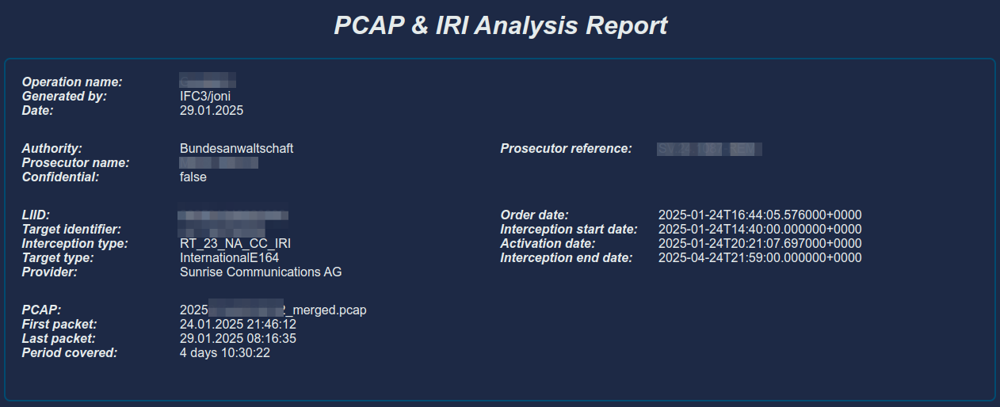

As mentioned in Introduction, this is the main script. It performs basic tasks and rely on subscripts for more complex ones.

### Testing:
Change the next constants.
```py
# Bypass the need to enter manually data and path to pcap at prompt.
TESTING = False
# Here you can copy path(s) to testing exports, simply un-comment testing one.
EXPORTS_PATH = f'{thy_constants.TEST_PATH}/small/'
# EXPORTS_PATH = f'{thy_constants.TEST_PATH}/another_file/'

# Change True to False to prevent opening default browser.
BROWSER = True
```
#### HACK Info Statements
There are some few places in the scripts with [HACK] info notes.
Those are useful for testing too.

### class Zeeked()
class: instantiate dataframes format, used in newapps.py.  
It has more or less the same structure as logfile_to_dataframe() which is called several times throughout NetFLICC.


### case_metadata_collection()
Collect information on case: operation name, generated by, date.

### cleanup()
Ensures clean exit and removes files.

### integrity_checks()
Ensures compulsory files such as conn.log exist. 

### intro_message()
Displays introduction message and verifies that current folder (case folder) is empty.

### main()
Launches the functions in specific order.  

> [!WARNING]
> Do not change the order!

For a better understanding of conn_data, check also newapps.py chapter.
```py
conn_data = newapps.SubZeeked('raw_data/conn.log')
```

### move_log()
netflicc.log is created in /tmp/ as everything will be deleted in intro_message().
Move netflicc.log to final directory.

### signal_handler()
Catches KeyboardInterrupt.
Works together with threading.Event() and a bunch of booleans.

[_ToTop_](#top) 
## importXP.py
importXP.py main task is to copy and process zip file(s), aka FLICC export(s) and collect metadata on the case.
It also performs first process on the merged pcap with NFStream.

### path_to_zips(), get_zip_files() and multi_task_rmunzipped()
Searching, seek and destroy 🎸🤟 the zip files.

### multi_task_unzip()
Use concurrent.futures.ThreadPoolExecutor to take advantage of multi-threading. 

### get_products() and find_pcaps_in_products()
Gets products, e.g. +41700000000 RT_23_NA_CC_IRI NA Sal 202406200000000 (see below).
Finds every single pcap files and prepares a list to be passed to mergecap.
<p align="center">
    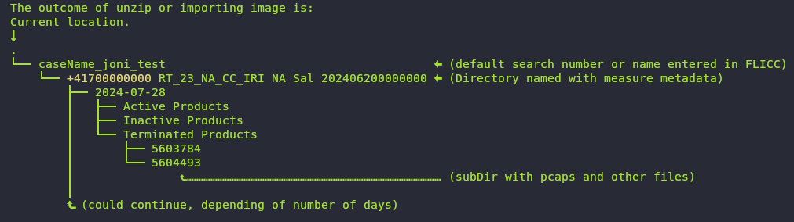

_Note: pcap files could be found either in Active/subdir/, Inactive/subdir/ or Terminated Products/subdir/._

### batch_mergecap(), mergecap_and_zeek() and multi_task_merging_zeek()
Mergecap could not work if too many files are passed for processing. Hence, creating batch of 250 pcap files appears to solve the issue.  

_Note: even though pcap files have the extension .pcap, they are actually gzip files. Mergecap handles this automatically._

### find_iri_csv()
Finds the iri file to be latter processed by gsma.py and mainly celloc.py, mainly by the latter one.

### find_target_info_csvfile()
Finds the file target_info.csv which contains case metada. The metadata will appear on top of the report.
<p align="center">
    


### pcap_to_nfstream()
Process the merged pcap with NFStream and converts to parquet format.
- [NFStream.org](https://www.nfstream.org/docs/)

[_ToTop_](#top) 
## meta_uAgent.py
<p align="center">
    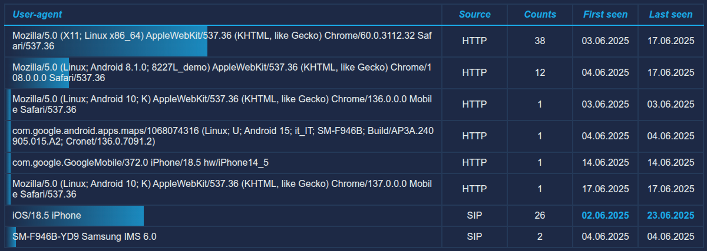

meta_uAgent.py main objective is to find user-agents in the pcap.
By default, it will render a filtered list to get a fast grasp on the result. An un-filtered list is created somehow and will be rendered in case the filtered list is empty.

The lists are found in:
```
./diverse/user_agents_filt.csv
./diverse/user_agents_full.csv
```
meta_uAgent.py processes http.log and the absence of this file will not break NetFLICC, however the next tasks will not be performed:
- no user-agent will be discovered, hence blank field in report.
- lack of http activity in the Average Daily Activity plot.
- no browsing activity will be discovered, hence blank field in report.

### logfile_to_dataframe():
This function is a core function in the sense it parses Zeek log files and converts them into Pandas dataframes.
Every zeek.log file has the same structure with headers found in line 7. If no header is found it would mean failure in Zeek processing or corrupted log files.

```py
def logfile_to_dataframe(log) -> pd.DataFrame:
    '''Format zeek log files to Pandas dataframe'''
    # Get line 7 which has headers.
    http_log = gb.glob(f'*/{log}')[0]
    log_headers = linecache.getline(http_log, 7).split('\x09')
    # Security check, line must start with #fields.
    if not log_headers.pop(0) == '#fields':
        rprint(Panel.fit("⛔ Headers not found, verify log file.", border_style='red'))
        sys.exit(9)

    # Load dataframe with headers.
    df = pd.read_csv(http_log, skiprows=8, sep='\x09', names=log_headers, low_memory=False)
    # Remove last line (#close).
    df.drop(index=df.index[-1], axis=0, inplace=True)

    # Adjust time format and allow datetime parsing.
    df['ts'] = pd.to_numeric(df['ts'])
    df['ts'] = pd.to_datetime(df['ts'], unit='s')
    # Convert to 'Europe/Zurich' time zone
    df['ts'] = df['ts'].dt.tz_localize('UTC').dt.tz_convert('Europe/Zurich')
    return df
```
### get_user_agent() and create_useragent_dataframe()
Parses http.log, creates a pandas dataframe and build the user-agent table.

[_ToTop_](#top) 
## gsma.py
<p align="center">
    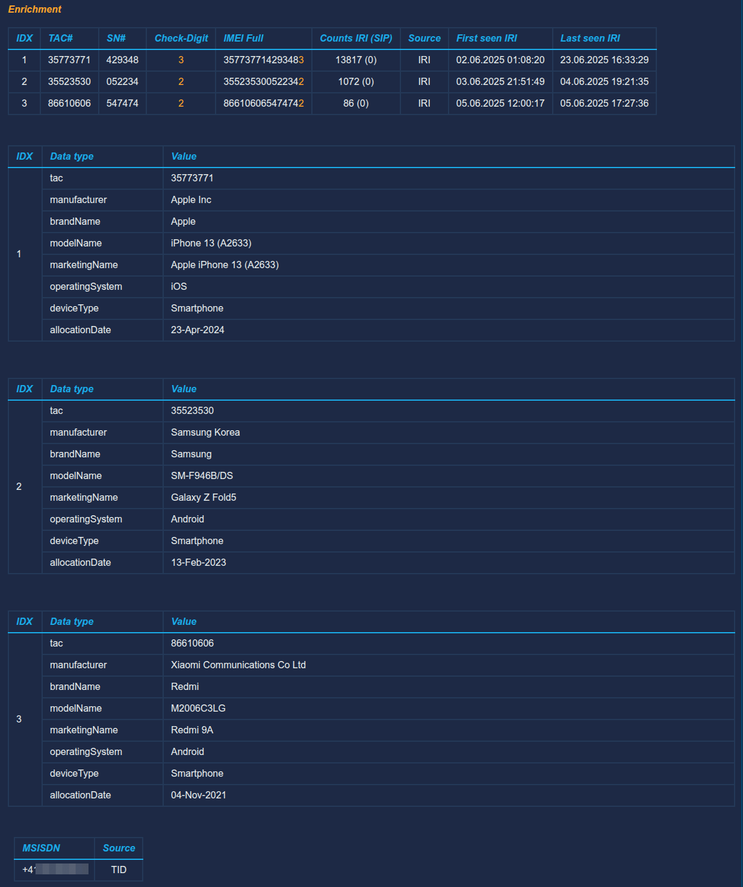

gsma.py's main feature is to get information related to device.

First it checks if the target identifier (tid) is an IMEI number (KISS). Then it parses the pcap file on the binary level to find IMEI patterns and finally it checks the iri file.

For each IMEI identified, gsma.py calculates the check-digit based on Luhn's formula.

Finally, it compares TACDB database to find a matching device. 

### find_iri_csv()
Converts iri.csv file to json. This step is needed to process the iri data with pandas.
Once in pandas, get the IMEI data and takes only the first 14 digits into account. Number 15 may change between true check-digit and 0 (standard number added by providers when tapping).

### imei_parser()
Checks for IMEI numbers at binary level using ngrep.

### tac_to_gsma()
Pick the Target Allocation Code from each IMEI and compare to gsma tacdb.txt.
TACDB is saved in NetFLICC installation path under TACDB/tacdb.txt.

### luhn()
calculates the check-digit based on Luhn's formula. This is reported as enrichment in comparison to raw data.

[_ToTop_](#top) 
## activity.py
activity.py crea<p align="center">
    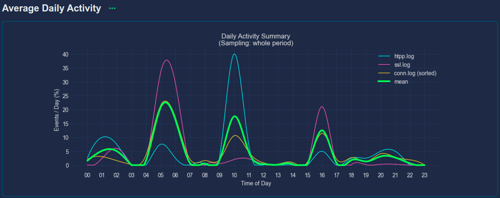
tes activity plots to help the user understand the network activity.

The plots are not created based on packets (bytes) being sent and received, but rather on the numbers of frames observed in zeek.logs. This choice has been made to prevent big data transfer being interpreted as peaks of activity. Even though this could be real activity, like watching NetFLICC 🤣, just kidding, I mean Netflix, it doesn't necessary mean real activity.
This should provide more linear curves in comparison to real user interactivity with the system.

The data per traffic type is easily obtained by the next functions. The data is then processed with matplotlib and this doesn't need detailed explanations.

### get_http_activity(), get_ssl_activity(), connexion_activity_sorted(), resp. not sorted()
All similar in structure, they create pandas dataframes.

### matplot()
Processes the data from above mentioned functions to render plots.

[_ToTop_](#top) 
## shift.py
activity.py crea<p align="center">
    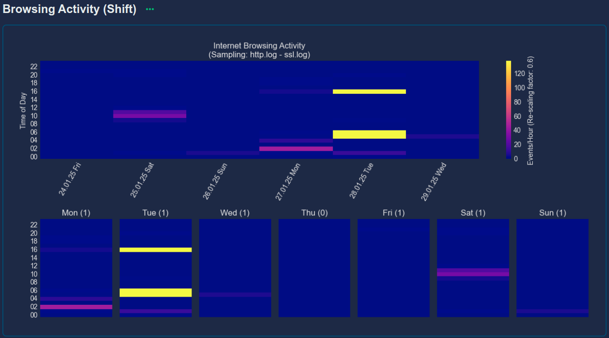

shift.py is very similar to activity.py in the sense it produces a heatmap plot that helps observing activity over a long period of time. Actually, the whole pcap data is processed and data rendered in plot.

[_ToTop_](#top) 
## webhis.py
<p align="center">
    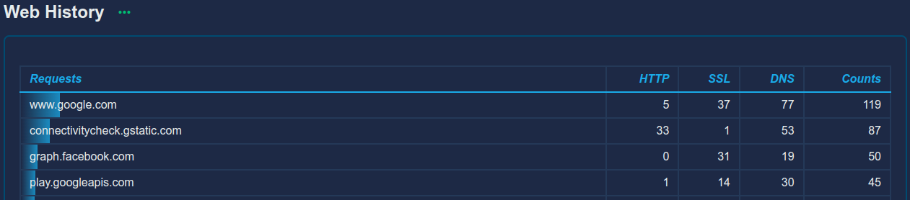

webhis.py parses data related to browsing activity. It checks http.log, dns.log and ssl.log. The combination of those three values gives a good overview of what is going on. 

### browsing_activity() and get_web_requests()
Processes pandas dataframes per log file and create a single table with counters. 

[_ToTop_](#top) 
## geoip_v2.py
<p align="center">
    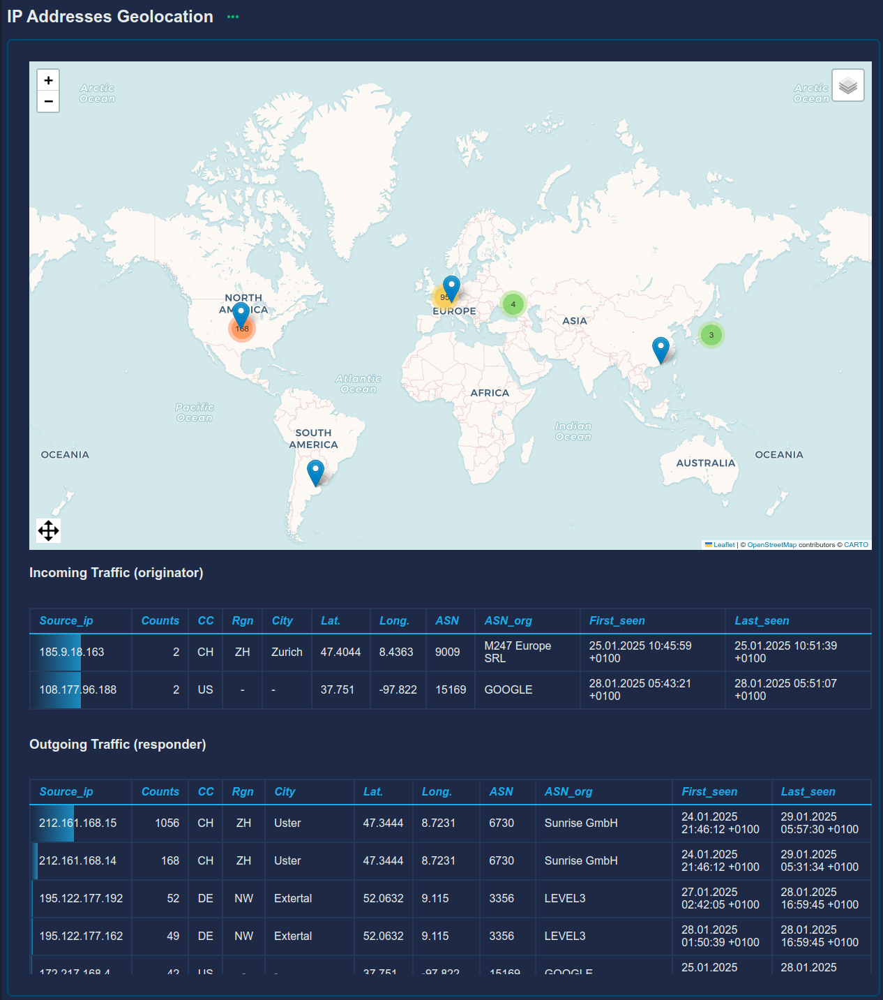

geoip_v2.py main purpose is to get all IP addresses from conn.log and get the geolocation related data. It transposes each located IP on a map, both for incoming and outgoing traffic. 

### @lru_cache
Decorator from functools module, allow caching the result of a function and should enhance script overall speed.

### geolocation_dataframe()
Creates a pandas dataframe with unique IP addresses and geolocation values.

### transpose_ips_on_map()
Transposes the geolocation data on a map using Folium.
Creates ./report/ipsmap.html.
- [Folium](https://python-visualization.github.io/folium/latest/)

[_ToTop_](#top) 
## celloc.py
<p align="center">
    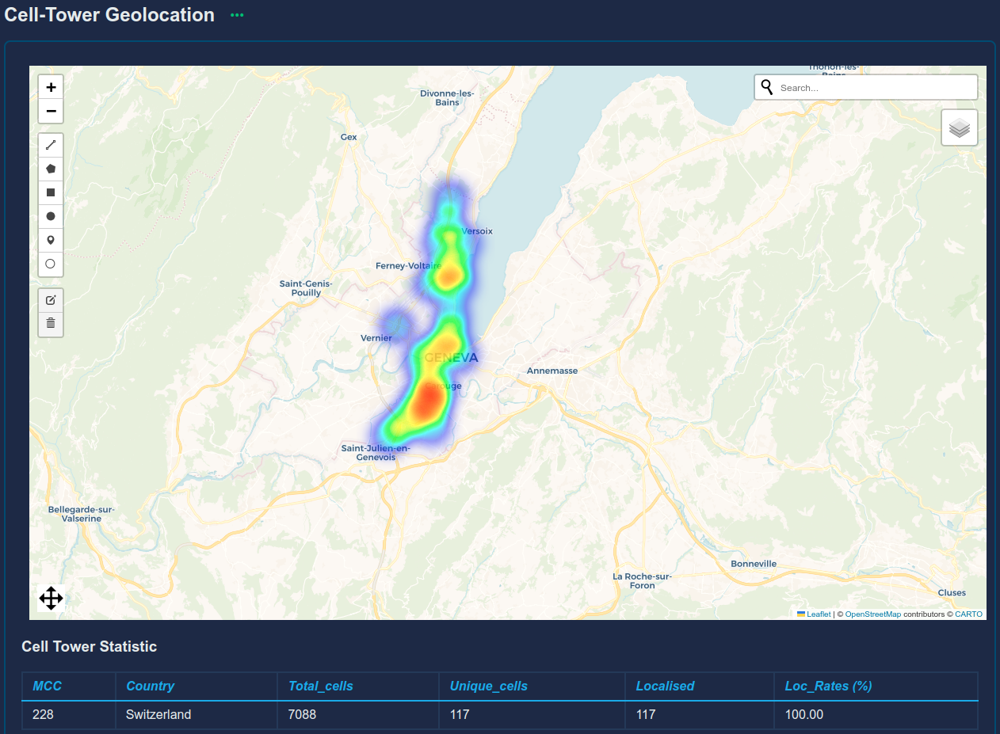

celloc.py checks the iri data and transposes the cell-tower data on a map for reporting. The iri data contains location coordinates, but only for Swiss cell-towers (mcc 228). For foreign cell-towers, it is necessary to check online. Currently we have three different ways to get the coordinates, which are:
- OpenCellID: free but could lack precision, load database or API access.
- Google API: paid service, each request matters even duplicates.
- Combain API: paid service.

As Google and Combain APIs are paid services, it means the number of requests are under limitations. Moreover, the API-keys are shared with other fedpol instances, hence requests must be controlled.

celloc.py checks for locations in the above depicted order, i.e from free to paid services. Furthermore, the next strategy applies:
- every single request that is not successful is cached in a file for 24-hour.
- successful requests are cached in a file for a year. 

Regarding OpenCellID, both downloading or checking the database online are possible. Downloading cell_towers.csv.gz, even though require manual handling, offers the advantage to make checks against it possible in any circumstances (Internet loss).
- [OpenCellID download page](https://opencellid.org/downloads.php?token=pk.254e269341ea44cf3a584ccf92d94f8c)


Cached data (thy_constants.py):
```py
API_CACHED_ONEYEAR = f"{installation_path}CONSTANTS/API_CACHED_ONEYEAR.parquet"
API_CACHED_ONEDAY = f"{installation_path}CONSTANTS/API_CACHED_ONEDAY.parquet"
```
### csv_to_json()
Converts iri file from csv to json.

### json_to_dataframe() and identify_column_content_type()
Loads the data into a pandas dataframe.  
The iri structure is quite complex and the csv file has nested dictionary values. This means that the first table (pandas dataframe) will have dictionary values which cannot be interpreted per se.  
identify_column_content_type() identifies the columns containing dictionary values and flattens them thanks pandas normalize function.

```py
# Flattening columns.
flattened_dfs = {}
for col in hasdic:
    try:
        # Split columns.
        flattened_df = pd.json_normalize(df[col])
        # Rename colums.
        flattened_df.columns = [f'{col}_{subcol}' for subcol in flattened_df.columns]
        flattened_dfs[col] = flattened_df
    except Exception as exc:
        rprint(f"[red]{exc}[/]")
```
### check_cached_oneday() and check_cached_oneyear_db()
Both functions perform more or less the same, i.e. checking if the cell-tower id has already been checked.

Below.
```py
# Check if API_CACHED_ONEYEAR.parquet exists.
if os.path.isfile(API_CACHED_ONEYEAR):
    api_cached_oneyear_init_df = pd.read_parquet(API_CACHED_ONEYEAR)
    # Filter on current year.
    ts_cut = int(time.time()) - 31536000 # 1 year.
    filt = (api_cached_oneyear_init_df['ts'] > ts_cut)
    api_cached_oneyear_init_df = api_cached_oneyear_init_df[filt]
```
_Note that both files are saved in parquet format. This has the advantage to minimise size and keep data types._

### check_opencellid()
Check unknown cell-towers against OpenCellID db.

### check_online_apis()
Providing the list of unknown cell-tower, there is a first check against the 1-day cached data. There is mere chance of a change within the last 24 hours and checking again the same data is worthless. Hence, it will quit the function if every cell-tower has been checked in the past 24 hours. If cell-towers remain, those will be processed by check_cell_towers(set).

###  check_cell_towers()
It uses a combination of booleans to determine which API to proceed with using api_requester().

### api_requester()
Uses python requests module to create requests on both Google and Combain APIs that share the same structure (see below). It also handles errors and retries.

```json
{
    "accuracy": 500,
    "location": {
        "lat": 59.331706,
        "lng": 18.079073
    },
    "logId": 1237798
}
```
_Combain answer._

```
Both Google and Combain apis share the same error codes.
400 = Parse Error / Invalid key.
403 = Out of credits.
404 = Not found (meaning cell tower not found, api is ok).
```
_Google and Combain error codes._

### dataframe_parser()
Parse the dataframe to get unique cell location related data only. In the case of NetFLICC, there will be only one call of this function. It produces the data that will appear on the map ./report/cells.html.

<p align="center">
    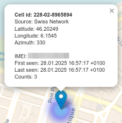

### add_azimuth_line() and transpose_cells_on_map()
Uses Folium to create and transpose data on a map. Regarding azimuth, only Swiss cell-towers have that information.

### mcc_checker()
Statistics on cell-towers and localisation ratios.

Mobile_codes library:
- Contains the country codes from ISO 3166-1 based on the code based on:  
    https://github.com/deactivated/python-iso3166/
- But also has the MCC and MNC codes based on the Wikipedia page:  
    http://en.wikipedia.org/wiki/List_of_mobile_country_codes
- As well as the latest released listing from ITU:  
    http://www.itu.int/dms_pub/itu-t/opb/sp/T-SP-E.212B-2014-PDF-E.pdf  
Note that MCC codes for a country can be:
    - None (no MCC code)
    - a string (where a country has one code)
    - a tuple of strings (where a country has more than one code)

### summary()
Creates a summary that would appear in NetFLICC loggings, both on terminal and in netflicc.log.
<p align="center">
    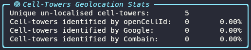

[_ToTop_](#top) 
## newapps.py
<p align="center">
    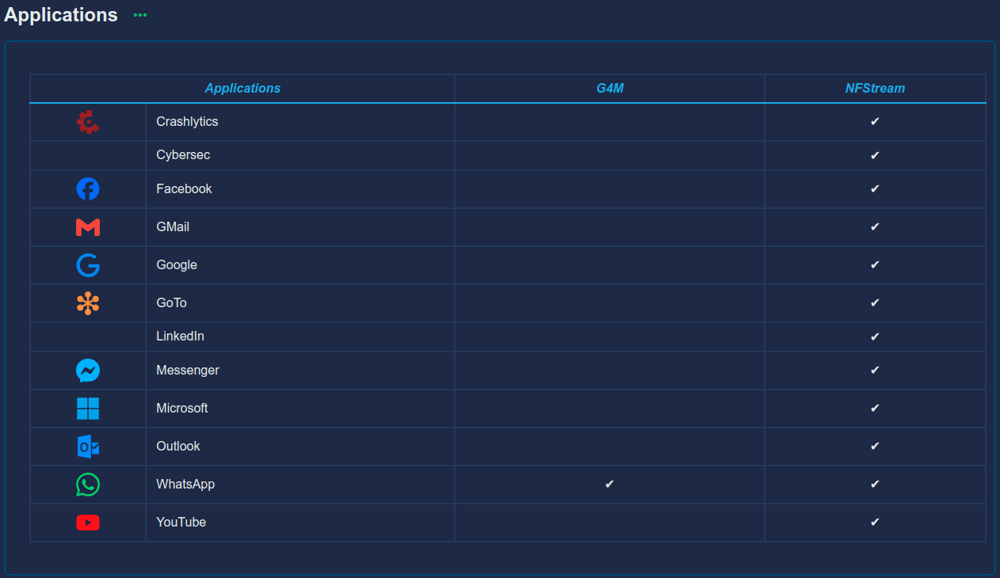

<p align="center">
    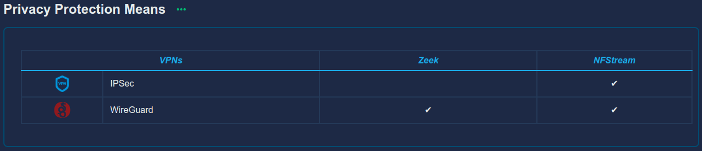

newapps.py collects information on applications, VPNs, and G4M specific apps. This script is a bit more complex and uses Classes and also an imported Class from netflicc.py (Zeeked).

### main()
Below the main() function helps to understand how newapps.py works. NetFLICC has two main ways of parsing data, i.e Zeek and NFStream, and this is reflecting below with Nfstreamed() and SubZeeked() classes.

main() takes conn_data_ as parameter. Looking at how the different dataframes or pieces of data are created, one could notice that conn_data is not obtained with SubZeeked(), at least it looks like so. The reason is that conn_data is created in netflicc.py from an import of newapps.SubZeeked(). This may sound weird indeed 🤔.


```py
def main(conn_data_) -> tuple[pd.DataFrame, pd.DataFrame, set[str]]:
    '''
    Script launcher.

    Returns:
    applications_df: pd.DataFrame
    vpn_df: pd.DataFrame
    apps_of_interest_list: set[str]
    '''
    with console.status("[bold italic green]Processing newapps.py ...[/]") as _:
        # Process NFStream data for applications.
        nfs_data = Nfstreamed(nfstream_file)
        nfs_data.get_apps()
        nfs_data.convert_dates()
        nfs_data.traffic_per_application()

        # Process Zeek data for Telegram application.
        # netflicc.py: conn_data = newapps.SubZeeked('raw_data/conn.log')
        console.log("checking Telegram...", style="italic yellow")
        conn_data = conn_data_
        conn_data.detect_telegram('ips.txt')

        # Process Zeek data for overall applications.
        console.log("checking applications...", style="italic yellow")
        dns_data = SubZeeked('raw_data/dns.log')
        dns_data.get_apps_subz(conn_data.telegram)

        # Check for vpn or other privacy protection means.
        console.log("checking vpns...", style="italic yellow")
        nfs_data.get_vpn_applications()
        http_data = SubZeeked('raw_data/http.log')
        http_data.detect_grapheneos()
        conn_data.detect_tor()
        conn_data.detect_vpns()

        # Create dictionary with {'appname': 'app_name'} naming convention.
        global dictionary_appnames
        dictionary_appnames = ApplicationNames(nfs_data.app_name)
        dictionary_appnames = dictionary_appnames.extend_app_name(apps_of_interest)

        # Build "Applications" and "Privacy Protection Means" dataframes.
        applications_df = applications_dataframe(dns_data, nfs_data)
        vpn_df = privacy_applications_dataframe(nfs_data.vpn,
                                                conn_data.is_tor,
                                                http_data.is_grapheneos,
                                                conn_data.is_wireguard,
                                                conn_data.is_openvpn)

        logger.info(f"module {__name__} done")
        return applications_df, vpn_df, apps_of_interest_list
```
### class ApplicationNames()
Collect every application's name with camel-toe format.

### class Nfstreamed()
Istantiate dataframe with nfstream and parquet.

- get_apps() creates an application list and takes into consideration an excluding list. Without it, the final list would be really long including almost every kind of protocols possible, such as:
```py
exclude_list = [
                'ajp',
                'afp',
                'bgp',
                'cassandra',
                'ciscoskinny',
                'ciscovpn',
                'coap',
                'cybersec',
                ...
                ..
                .
```
- convert_dates() convert unix timestamp to datetime and to csv.
- get_vpn_applications() checks for vpns.
- traffic_per_application() create a table that allows to determine which application has the most data traffic. This table is not embedded into the report for the moment.

### class SubZeeked(Zeeked)
The class is called with a Zeek log file as parameter. The parameter, respectively the log is directly processed with the Zeeked class.
The next functions are part of the class:
- detect_messenger(): not used any longer.
- get_apps_subz() finds Telegram and Messenger apps.
- detect_tor() finds TOR traces.  
Tor comparison list (dan.txt) which is available online at https://www.dan.me.uk/torlist/?full must not be fetched sooner as every 30 minutes on the risk of being blocked from the website. Hence, there is a watchdog that prevents downloading the list too early. The limit is set to 6 hours.
 <p align="center">
    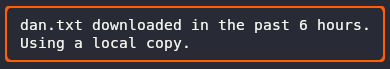

- detect_grapheneos() finds Graphenos system.
- detect_vpns() finds vpns.

### png_to_base64()
Converts png file to base64.

### privacy_applications_dataframe()
Create dataframe with Zeek and NFStream vpn data. This is the table that will be rendered into the report. This is where application's logo are either obtained from https://cdn.simpleicons.org/ or in ./app_icons/.
 

[_ToTop_](#top) 
## ftree.py
ftree.py creates a tree structure to get things sorted out.
 <p align="center">
    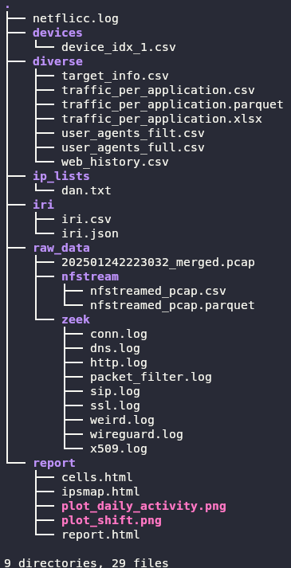

[_ToTop_](#top) 
## reportGen.py
reportGen.py uses jinja2 module to create data that will be passed to an html template. It gather every data processed so far and make adaptations for html.

- add_colspan() and add_rowspan()  
Allow to merge several cells horizontally, respectively vertically.
- bar_style()  
Display bar chart of ['counts'].
- convert_plot_to_base6()
- generate_html()  
Generate html report based on ./templates/template.html.
- highlight_max_font() and highlight_min_font()  
Highlight max, respectively min values font instead of cell.
- metadata()  
Return data used in template.html in the metadata section.
- png_to_base64()

[_ToTop_](#top) 
## thy_modules.py
thy_modules.py main goal is to associate logo to applications identified by NFStream or Zeek. It also contains other useful stuff.
- special_slugs: dictionary for slugs whose name don't match simple-icons ones.
- nologo_list: list of applications whose logos are not found in simple-icons.
- apps_of_interest: list of applications whihc are of interest for g4m.
- exclude_list: list of applications or protocols that should not appear in report.
- db(): debugging function that could be used to debug in every python script.
- timer(): decorator function that returns running time of its associated function.  
It is used only once in netflicc.py, main() and the result is only in netflicc.log.

[_ToTop_](#top) 
## template.html
template.html builds the report in the form of a webpage.

## LOGGING
NetFLICC produces log at running time and also create netflicc.log.  

rich.console module is used to log on terminal.
<p align="center">
    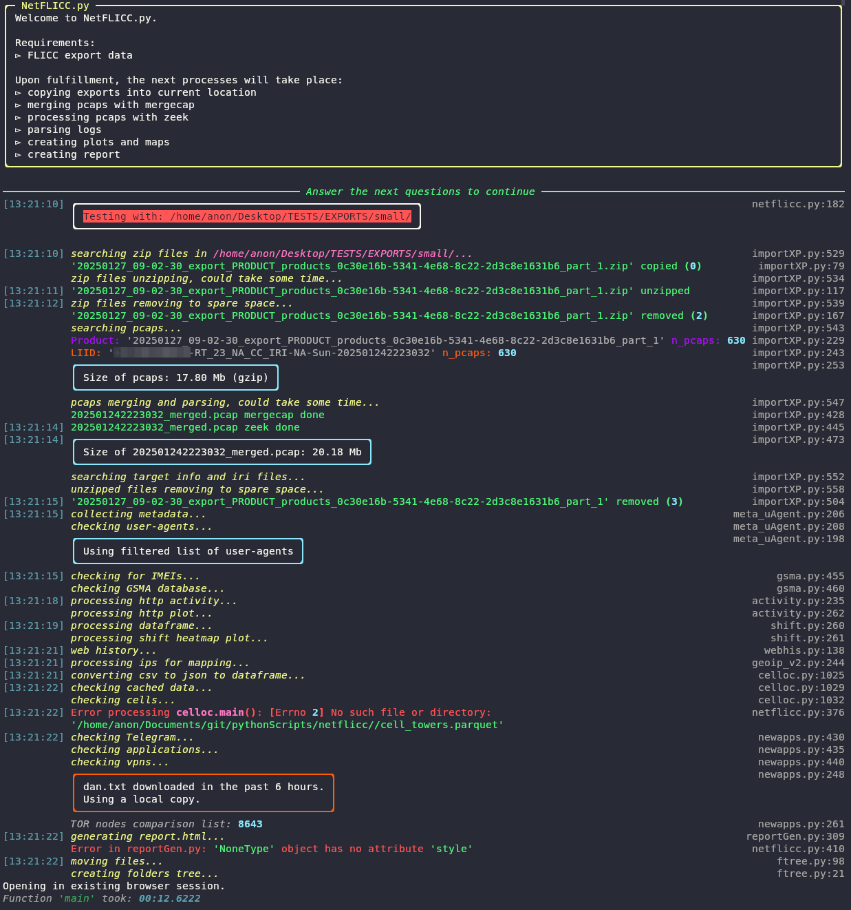

logging module creates logging file, netflicc.log.
<p align="center">
    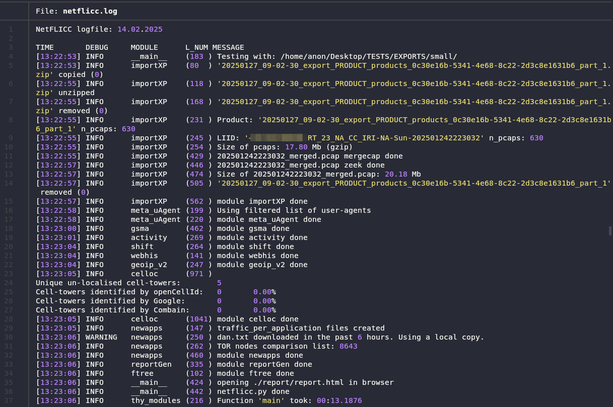


[_ToTop_](#top) 
## Improvements Possibilities
### Dataframe handling
The next two tables show the ['fields'] that are need per log and script.

For example, webhis.py needs http.log and the fields ['ts', 'host'].

<p align="center">
    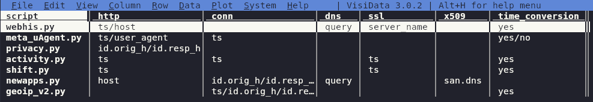

<p align="center">
    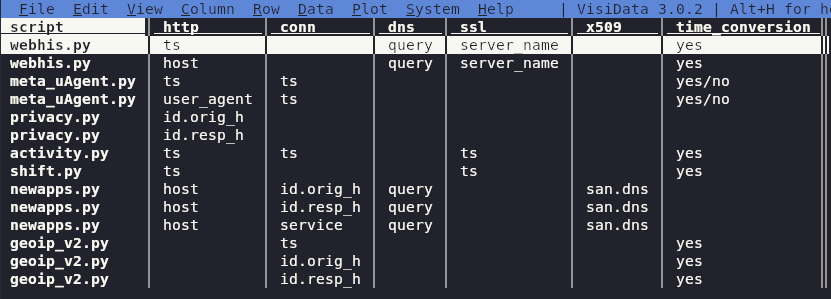

### OpenCellID dataset download
It should be possible to automate the download of cell_towers.csv.gz. At least verifying the creation date and displaying some warning message if too old.

Currently the user needs running gunzip on the cell_towers.csv.gz which will create cell_towers.csv. Running openCellID2parquet.py will convert the csv to parquet. Mixing both gunzip and the python script is possible.

[_ToTop_](#top) 
